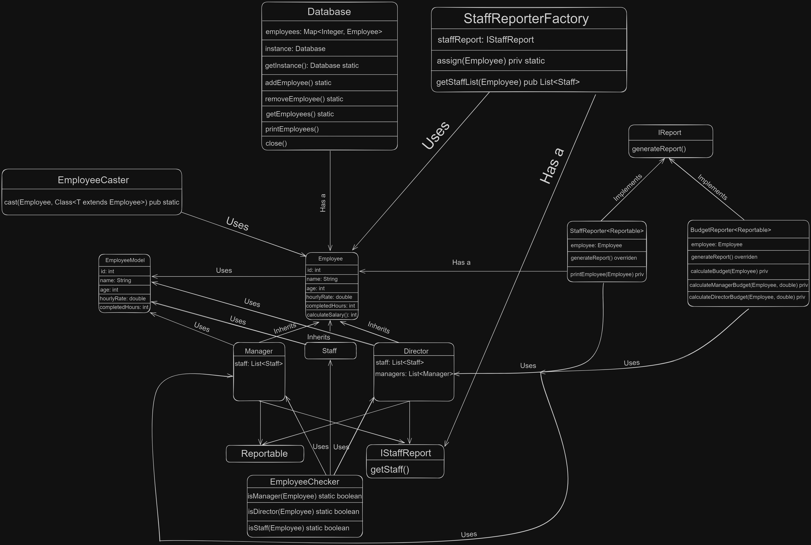

# EmployeeModel
## Description
A record of employee information such as:
* `ID` - `int`
* `Name` - `string`
* `Age` - `int`
* `Hourly Rate` - `double`
* `Completed Hours` - `double`

It's a record, so it only has getters, an overridden `equals()`.

## Usage
Sent in as an argument to the `Employee`, `Staff`, `Manager`, and `Director` constructors.

## Examples
```java
Staff staffJohn = new Staff(1, "John Doe", 25, 15.00, 40.00);
```

# Employee
## Description
A sealed class (which permits to `Director`, `Manager`, and `Staff`) that represents an employee, whether it be a `Staff`, `Manager`, or `Director` and has shared methods and fields between them and overrides `toString()`, `equals()`, and `hashCode()` to use as a key in a `HashMap`.

## Usage
Used as a base class for `Staff`, `Manager`, and `Director`.

## Examples
```java
Employee managerJohn = new Manager(1, "John Doe", 25, 15.00, 40.00);
```

# Staff
## Description
A class that represents a staff member, which is an `Employee`

# Manager
## Description
A class that represents a manager, which is an `Employee`, and has a `List<Staff>` member which represents the staff members that the manager manages.

## Implements
* `Reportable`
* `IStaffReport`

# Director
## Description
A class that represents a director, which is an `Employee`, and has both a `List<Staff>` and `List<Manager>` member which represents the staff members and managers that the director manages.

## Implements
* `Reportable`
* `IStaffReport`

# Reportable
## Description
An empty interface that is used to mark classes that can be reported on.

# IReport
## Description
An interface that has a `generateReport()` method that prints out a report.

## Usage
Used by `StaffReporter` and `BudgetReporter`.

## Examples
```java
IReport staffReport = new StaffReporter(new Manager(...));
```

# StaffReporter
## Description
A class that implements `IReport` that takes `T` which extends `Reportable` and has a `generateReport()` method that prints out a report of the `T` object.

## Implements
* `IReport`

## Usage
Used to print out a report of a `Staff` list.

# BudgetReporter
## Description
A class that implements `IReport` that takes `T` which extends `Reportable` and has a `generateReport()` method that prints out a report of the `T` object.

## Implements
* `IReport`

## Usage
Used to print out a report of the budget for both `Manager` or `Director` list.

# Database
## Description
A class that has a `HashMap<Integer, Employee>` member that represents a database of employees and has methods to add, remove, and get employees from the database.

## Usage
Used to store employees and retrieve them.

# Internal Packages
### Description
The internal packages that are used by `com.jam` that are not meant to be used outside of it

## EmployeeCaster
### Description
A class that casts an employee to either a `Manager` and `Director` using `cast` which takes the employee and a `Class<T>` and returns the employee that is cast to the class.

### Usage
Used to cast an `Employee` to either a `Manager` or `Director`.

### Examples
```java
EmployeeCaster.cast(employee, Manager.class);
```

## IStaffReport 
### Description
An interface that has a `getStaff()` method that returns a list of staff for both the `Manager` and `Director`

## StaffReporterFactory
### Description
A factory class that has a `getStaffList` that takes an `Employee`, casts it into either a `Manager` or `Director` and returns the staff that the specific employee has.

## EmployeeChecker
### Description
A class that has `isStaff`, `isManager`, and `isDirector` methods that checks if an employee is a `Staff`, `Manager` or `Director` and returns a boolean.

# Diagram

